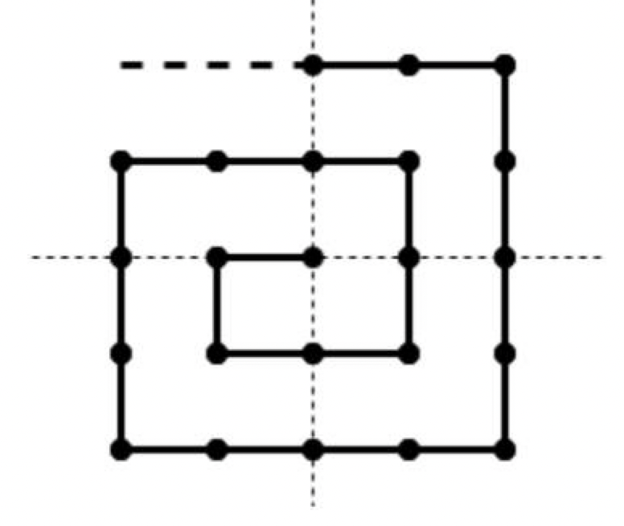

### Define robot coordinates

### Description

---
Given a robot that walks in spiral, define the coordinates where the robot will be 
after N - steps.
Initially, the robot starts from the (0, 0) coordinates
and walk in the following order:
(0, 0), (-1, 0), (-1, -1), (0, -1), (1, -1), (1, 0), 
(1, 1), (0, 1), (-1, 1), (-2, 1), ...

### Input
You are given a non-negative
number (`0 <= N <= 10^6`) - the number of step that robot has made

### Output
Return an array of two numbers - coordinates
where the robot will be after - N steps.
`array[0] -> x, array[1] -> y`

### Example 1

#### Input
`steps - 0`

#### Output
`0 0`

---
### Example 2

#### Input
`steps - 1`

#### Output
`-1 0`

---
### Example 3

#### Input
`steps - 2`

#### Output
`-1 -1`

---
### Example 4

#### Input
`steps - 14`

#### Output
`0 -2`

